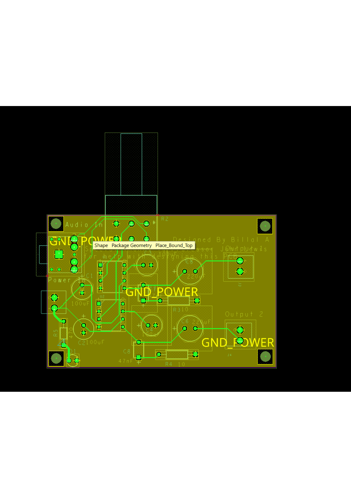

# Audio Amp Board

Audio amplifier PCB designed with Cadence OrCAD and Allegro. The project includes the schematic, PCB layout, source design files, and Gerber files for fabrication.

## PCB Layout

## Schematic

## Features

- Audio amplifier PCB design
- Custom schematic and PCB layout
- Designed using Cadence OrCAD and Allegro
- Gerber files included for PCB fabrication
- Complete source design files included

## Design

The schematic was created in Cadence OrCAD Capture and the PCB layout was completed in Cadence Allegro PCB Editor.

The repository includes the original design files along with Gerber fabrication files.

## Files

- `PCB Files/Audio Amplifer Board.opj` - OrCAD project file
- `PCB Files/AUDIO AMPLIFER BOARD.DSN` - OrCAD schematic design
- `PCB Files/Retry_Allegro_board.brd` - Allegro PCB layout
- `Gerber Files.zip` - Gerber files for PCB fabrication

## Design Software

- Cadence OrCAD Capture
- Cadence Allegro PCB Editor
